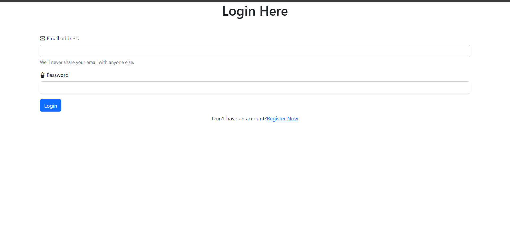

# 🛒 Django E-commerce Website

This is a full-stack E-commerce website built with **Django**. The project includes all core functionalities of an online shopping platform: product listing, detailed product views, search, user authentication, and a dynamic shopping cart.

Users can browse and search products, view detailed information, log in to manage their cart, adjust item quantities, remove items, and view a live summary of their order.

---

## 🚀 Features

- 🔍 **Search Products** – Search for items by keywords.
- 📄 **Product Detail Page** – View detailed info about each product.
- 🔐 **User Login Required to Add to Cart** – Secure authentication system.
- 🛒 **Dynamic Shopping Cart**
  - Add items to cart (login required)
  - Increase or decrease item quantities
  - Remove items from the cart
  - View real-time cart summary with:
    - Total items
    - Total quantity
    - Total price
- ✅ **Order Summary Section** – Clear overview of cart contents and cost.

---

## 🛠️ Tech Stack

- **Backend:** Django (Python)
- **Frontend:** HTML, CSS, JavaScript (Django Templates)
- **Database:** SQLite
- **Styling:** Bootstrap

---


## 🔧 Setup Instructions

1. **Clone the Repository**
   ```bash
   git clone https://github.com/deepanshu01-dev/ecommerce-platform-django

2. Create a Virtual Environment

python -m venv venv
source venv/bin/activate  # On Windows: venv\Scripts\activate

3. Install Dependencies

pip install -r requirements.txt

4. Apply Migrations

python manage.py makemigrations
python manage.py migrate

5. Create a Superuser

python manage.py createsuperuser


6. Run the Server

python manage.py runserver

7. Open in Browser

http://127.0.0.1:8000/

## 📸 Screenshots

### 🏠 Home Page


.png)


### 🔐 Login Page


### 🛒 Cart Page


### 📦 Product Details Page


### 🔍 Search Results Page


## ✅ Future Improvements

Here are some enhancements planned for future versions of the project:

- 🧾 **Checkout and Payment Integration** (e.g. Stripe or Razorpay)
- 📂 **Product Categories and Filters**
- 🔁 **Order History and User Profiles**
- 💖 **Wishlist / Save for Later Functionality**
- 📱 **Mobile-Responsive Design Improvements**
- 📦 **Stock Management System**
- 📝 **Product Reviews and Ratings**


## 🧑‍💻 Author

Made with ❤️ by **Deepanshu**  
🔗 [GitHub](https://github.com/deepanshu01-dev)

---

## 📄 License

This project is licensed under the **MIT License** – you're free to use, modify, and share it.


